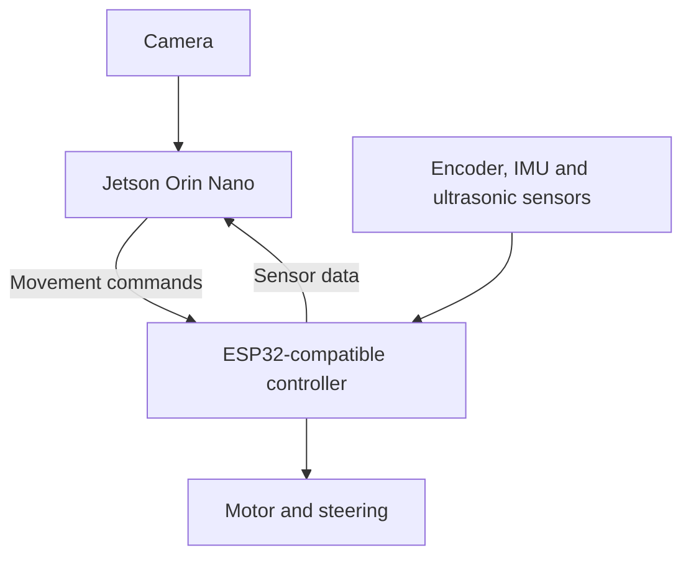

WRO Future Engineers – Autonomous Vehicle
This repository documents our autonomous vehicle for the WRO Future Engineers competition. Our goal is to build a reliable car that can understand the track, make driving decisions, avoid obstacles, and complete each challenge without manual control.
> **Project status:** The vehicle is currently being built and tested. Photos, performance videos, and final results will be added as development continues.
Team Information
	
Team name	Ibn_Roshd
Country	Saudi Arabia
City	Riyadh
Competition	WRO Future Engineers
Team member	Abdulaziz Nasser Al-Mindil
Coach	Engineer Mohammed Emam
Team Photos
<!-- Add your team photo to images/team/team-photo.jpg, then remove this comment. -->

Our Vehicle
Our car uses an NVIDIA Jetson Orin Nano as its main computer. It processes the camera image, detects track features and obstacles, makes mission decisions, and records useful testing information.
A separate ESP32-compatible controller handles the parts that need fast, real-time control:
Drive motor
Steering
Wheel encoder
IMU
Ultrasonic sensors
Start and reset controls
The Jetson and the controller communicate through USB serial. This allows the Jetson to focus on vision and decision-making while the controller manages movement and sensor readings.

How the Car Works
Jetson Orin Nano
The Jetson is responsible for:
Capturing and processing the camera image
Detecting coloured track lines and pillars
Choosing the correct driving action
Running the autonomous mission
Saving logs for testing and troubleshooting
Real-Time Controller
The controller is responsible for:
Controlling motor speed and direction
Moving the steering system
Reading the wheel encoder and IMU
Measuring distance with ultrasonic sensors
Receiving commands from the Jetson
Stopping the vehicle safely if communication is lost
Development Method
We are building and testing the car one part at a time. Each system is checked separately before everything is combined into the complete autonomous vehicle.
Our testing order is:
Power and wiring
Jetson software
Controller communication
Steering and motor control
Encoder, IMU, and ultrasonic sensors
Camera and colour detection
Slow driving tests
Corner and obstacle tests
Complete autonomous runs
Open Challenge — 30 Points
In the Open Challenge, the vehicle must:
Start autonomously
Complete 3 laps
Stay inside the track
Detect and follow the correct driving direction
Stop after completing the challenge
Obstacle Challenge — 62 Points
In the Obstacle Challenge, the vehicle must:
Complete 3 laps autonomously
Pass red pillars on the right
Pass green pillars on the left
Avoid moving or knocking over the pillars
Park in the correct area at the end
Vehicle Photos
<!-- Replace these files with real photos after the vehicle is finished. -->
Front view	Side view
	

Electronics	Camera mounting
	
Performance Video
A full performance video will be added after the vehicle and autonomous code are ready.
Video: Coming soon
Short testing videos and results will also be available in the `testing/` folder.
Repository Structure
```text
README.md             Project overview and team information
hardware/             Electronics, wiring, parts, and pin connections
software/jetson/      Camera, vision, mission, and logging code
software/controller/  Motor, steering, and sensor-control code
CAD/                  3D models and vehicle design files
images/               Team, vehicle, wiring, and testing photos
testing/              Test videos, results, logs, and troubleshooting
```
Current Progress
[x] Jetson Orin Nano operating system setup
[x] Main software package prepared
[ ] Final vehicle assembly
[ ] Complete hardware wiring
[ ] Steering and motor calibration
[ ] Sensor calibration
[ ] Camera colour tuning
[ ] Open Challenge testing
[ ] Obstacle Challenge testing
[ ] Final performance video
More Information
This repository will be updated throughout the project. New photos, code changes, testing results, and troubleshooting notes will be added as the vehicle improves.
